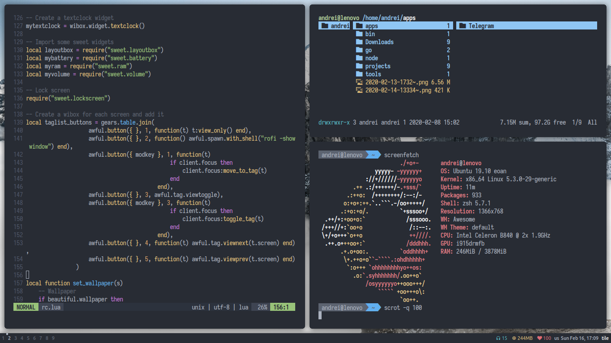
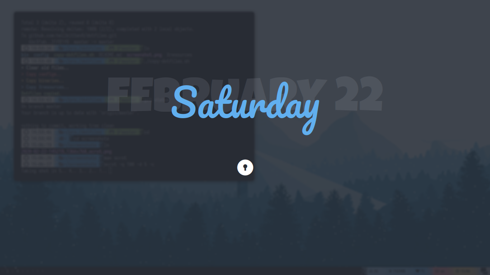

### Dotfiles

##### Lock screen

#### Details
- OS: Ubuntu
- WM: Awesome

#### Dependencies:
- pulseaudio - control volume
- alacritty - terminal
- redshift - night light
- compton (chjj) - window compositor
- scrot - screenshot tool
- rofi - app launcher

###### Optional
- acpid - subscribe acpi events
- cpufrequtils - cpu governor switcher
- mpd, mpc, ncmpcpp - music player daemon and ncmpcpp client
- nvim - text editor

#### Fonts:
- Ubuntu (Interface)
- Ubuntu Nerd Font (Iconic widgets on wibar)
- Pacifico and Luckiest Guy (Lock screen)
- Iosevka (Terminal)
- Icomoon (Lock screen)

#### Notes:
The script `copy-dotfiles.sh` is used for copy dotfiles into git working directory. To make this setup work on your system you should copy config files manually.

#### One Dark Colors
- red `#e06c75`
- green `#98c379`
- blue `#61afef`
- yellow `#e5c07b`
- purple `#c678dd`
- cyan `#56b6c2`
- text `#abb2bf`
- comments `#5c6370`
- background `#282c34`
- background dark `#21252b`
- background selected `#4d78cc`
- text selected `#ffffff`
